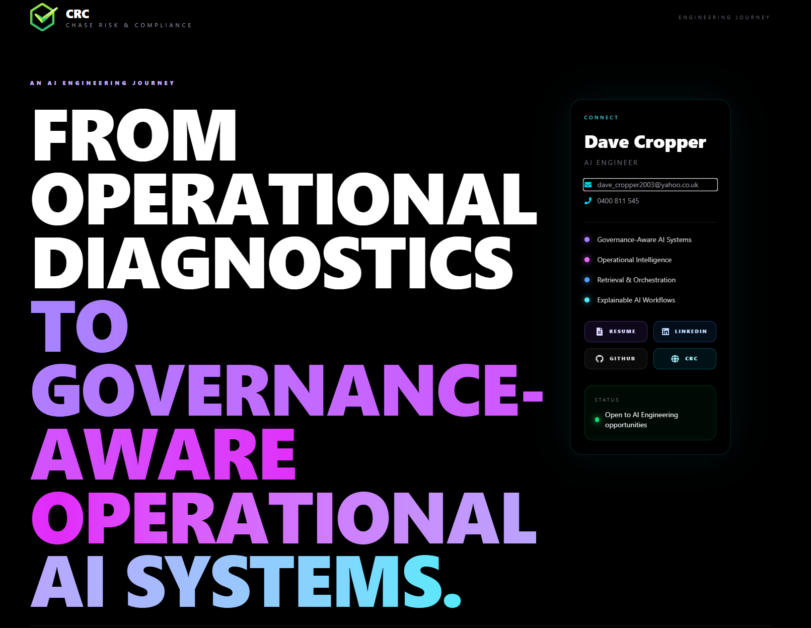
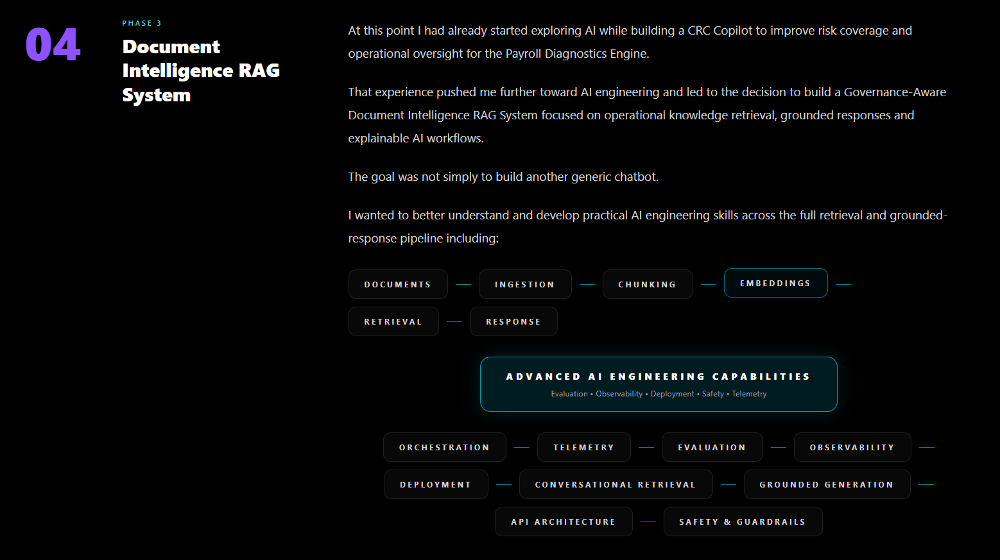
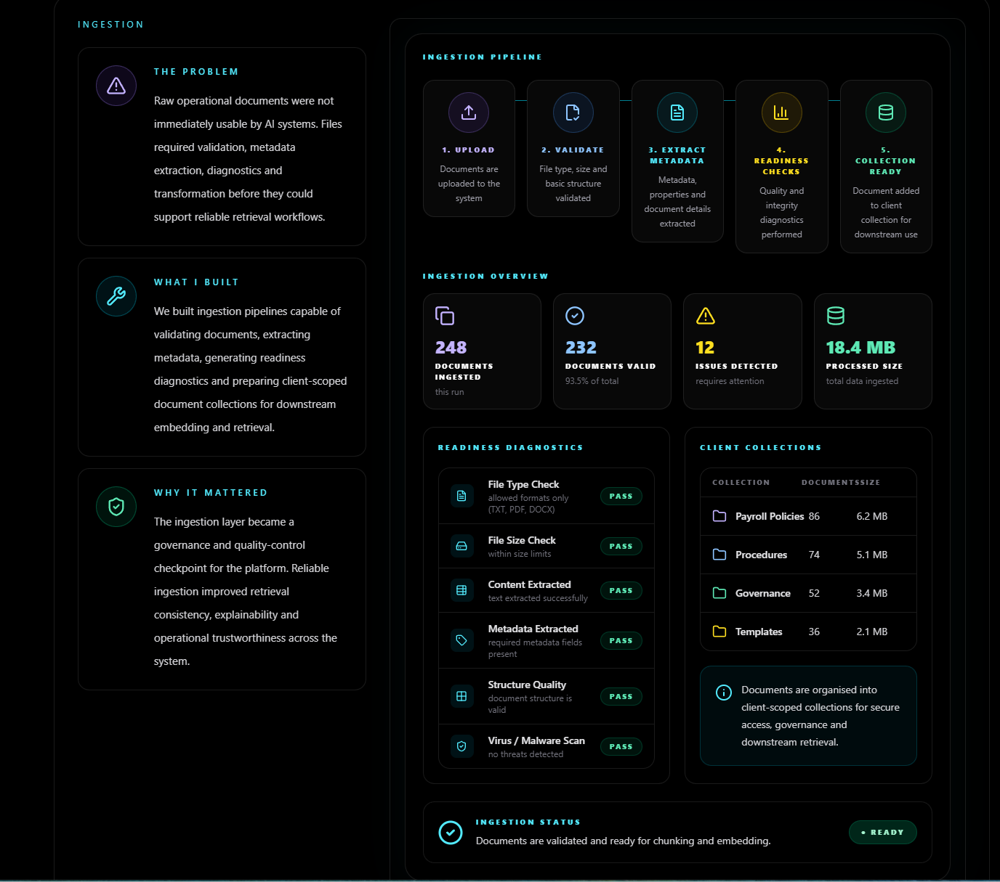

# AI Engineering Journey

An interactive portfolio showcasing my progression from Data Engineering and Operational Intelligence into AI Engineering, Retrieval-Augmented Generation (RAG), Governance-Aware AI, and Operational Decision Support systems.

## Live Portfolio

🌐 Portfolio Showcase

https://journey.chaseriskandcompliance.com.au/

## Overview

This repository contains the source code for my interactive AI Engineering Journey portfolio.

The portfolio presents the systems, architectures, engineering decisions, and AI concepts explored through a series of increasingly sophisticated projects spanning operational diagnostics, governance systems, retrieval engineering, explainable AI, and production-oriented AI platforms.

The goal is to demonstrate not only what was built, but why it was built, the engineering challenges encountered, and the lessons learned throughout the transition into AI Engineering.

## Portfolio Screenshots

### AI Engineering Journey Homepage

The landing page of the interactive portfolio, presenting the progression from operational systems and governance-focused engineering into modern AI engineering, retrieval systems, and governance-aware AI platforms.



---

### Governance-Aware Document Intelligence RAG System

An overview of the Governance-Aware Retrieval-Augmented Generation (RAG) platform, highlighting the major architectural layers involved in building a production-oriented AI system focused on explainability, trust, and grounded responses.



---

### Document Intelligence – Ingestion Layer

A detailed view of the ingestion layer responsible for accepting documents, validating inputs, preparing content for chunking, and establishing the foundation for retrieval and downstream AI workflows.



---

## Live Portfolio

Explore the interactive portfolio:

**Portfolio:** https://journey.chaseriskandcompliance.com.au/

## Source Code

**GitHub Repository:** https://github.com/dcrops/AI-Engineering-Journey

The portfolio contains:

* Public Holiday Entitlements Platform
* Payroll Diagnostics Engine
* Governance-Aware RAG Platform
* AI Engineering Architecture Walkthroughs
* System Design Decisions
* AI Engineering Learning Journey


### Phase 1 — Public Holiday Entitlements Engine
A governance-focused operational application designed to resolve complex public holiday entitlement rules across Australian jurisdictions.

Key concepts:
- Address normalisation
- Geographic resolution
- LGA and regional matching
- Entitlement rule evaluation
- Auditable outputs

### Phase 2 — Payroll Diagnostics Engine
A payroll diagnostics platform designed to identify operational risk, data integrity issues, compliance concerns and governance gaps across payroll datasets.

Key concepts:
- Data ingestion
- Validation and integrity checking
- Rule-based diagnostics
- Risk findings
- Executive reporting

### Phase 3 — Governance-Aware Document Intelligence RAG System
A production-minded Retrieval-Augmented Generation (RAG) platform focused on grounded responses, explainability, observability and operational trust.

Key concepts:
- Document ingestion
- Chunking strategies
- Embeddings
- Retrieval engineering
- Grounded generation
- Evaluation frameworks
- Telemetry
- Observability
- Safety and guardrails
- Deployment architecture

### Phase 4 — Operational Intelligence Copilot (Roadmap)
The next planned evolution of the platform, focused on operational reasoning over structured business data.

---

## Technology Stack

- React
- Vite
- Tailwind CSS
- Framer Motion
- Lucide React

---

## AI Engineering Concepts Demonstrated

### Retrieval & Knowledge Systems
- Retrieval-Augmented Generation (RAG)
- Conversational Retrieval
- Query Rewriting
- Grounded Generation
- Source Attribution

### AI Platform Engineering
- Orchestration
- API Architecture
- Deployment Design
- Telemetry
- Observability

### Reliability & Governance
- Evaluation Frameworks
- Confidence Evaluation
- Safety & Guardrails
- Explainable AI
- Governance-Aware Design

### Operational Systems
- Data Ingestion
- Validation Pipelines
- Rule Engines
- Risk Diagnostics
- Executive Reporting

---

## Running Locally

```bash
npm install
npm run dev
```

Build for production:

```bash
npm run build
```

---

## Author

**Dave Cropper**

- LinkedIn: https://www.linkedin.com/in/david-cropper/
- GitHub: https://github.com/dcrops
- Portfolio: https://journey.chaseriskandcompliance.com.au/
- Website: https://www.chaseriskandcompliance.com.au/

---

## Purpose

This repository serves as a visual portfolio demonstrating the progression from operational software engineering into modern AI engineering, with a focus on governance-aware systems, operational intelligence and trustworthy AI workflows.
